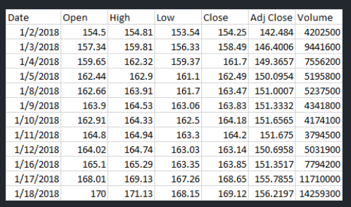

# 📊 Equity Portfolio Analysis - DS 637 Midterm Project

A comprehensive equity portfolio analysis project examining the performance, risk metrics, and correlations of major technology stocks using Python and data visualization techniques.



---

## 📋 Table of Contents

- [Overview](#overview)
- [Dataset](#dataset)
- [Technologies Used](#technologies-used)
- [Project Structure](#project-structure)
- [Installation](#installation)
- [Usage](#usage)
- [Analysis Components](#analysis-components)
- [Key Findings](#key-findings)
- [Contributing](#contributing)
- [License](#license)

---

## 🎯 Overview

This project is part of the DS 637-852 (Python & Mathematics) course midterm assignment at NJIT. It performs an in-depth analysis of a technology-focused equity portfolio using historical stock data from 2018.

**Objectives:**
- Analyze the performance of 10 technology stocks
- Calculate key portfolio metrics (returns, volatility)
- Visualize stock price trends and correlations
- Assess risk and diversification opportunities

---

## 📁 Dataset

The project analyzes 2018 historical stock data for the following companies:

| Ticker | Company Name               | Sector          |
|--------|----------------------------|------------------|
| AAPL   | Apple Inc.                 | Technology       |
| AMZN   | Amazon.com Inc.            | E-commerce/Tech  |
| GOOG   | Alphabet Inc. (Google)     | Technology       |
| IBM    | IBM Corporation            | Technology       |
| META   | Meta Platforms Inc.        | Social Media     |
| MSFT   | Microsoft Corporation      | Technology       |
| NFLX   | Netflix Inc.               | Streaming/Tech   |
| ORCL   | Oracle Corporation         | Technology       |
| SAP    | SAP SE                     | Enterprise Tech  |
| TSLA   | Tesla Inc.                 | Electric Vehicles|

**Data Source:** Historical stock prices (2018)  
**Format:** CSV files containing daily OHLCV (Open, High, Low, Close, Volume) data

---

## 🛠️ Technologies Used

- **Python 3.10+** - Core programming language
- **Jupyter Notebook** - Interactive analysis environment
- **NumPy** - Array computations and numerical operations
- **Pandas** - Data manipulation and analysis
- **Matplotlib** - Data visualization
- **Seaborn** - Statistical visualizations

---

## 📂 Project Structure

```
DS637---Equity-Portfolio-Midterm-Project/
│
├── README.md                      # Project documentation
├── midterm_project.ipynb          # Main Jupyter notebook with analysis
├── image.png                      # Portfolio analysis visualization
│
├── AAPL_2018.csv                  # Apple stock data
├── AMZN_2018.csv                  # Amazon stock data
├── GOOG_2018.csv                  # Google stock data
├── IBM_2018.csv                   # IBM stock data
├── META_2018.csv                  # Meta stock data
├── MSFT_2018.csv                  # Microsoft stock data
├── NFLX_2018.csv                  # Netflix stock data
├── ORCL_2018.csv                  # Oracle stock data
├── SAP_2018.csv                   # SAP stock data
└── TSLA_2018.csv                  # Tesla stock data
```

---

## 🚀 Installation

### Prerequisites

- Python 3.10 or higher
- Git
- Jupyter Notebook

### Setup Instructions

1. **Clone the repository**

```bash
git clone git@github.com:CxLos/DS637---Equity-Portfolio-Midterm-Project.git
cd DS637---Equity-Portfolio-Midterm-Project
```

2. **Create and activate a virtual environment**

```bash
# Windows
python -m venv venv
venv\Scripts\activate

# Mac/Linux
python3 -m venv venv
source venv/bin/activate
```

3. **Install required packages**

```bash
pip install numpy pandas matplotlib seaborn jupyter
```

Or if a `requirements.txt` is available:

```bash
pip install -r requirements.txt
```

---

## 💻 Usage

### Running the Jupyter Notebook

1. **Launch Jupyter Notebook**

```bash
jupyter notebook
```

2. **Open the notebook**

Navigate to `midterm_project.ipynb` in the Jupyter interface and run the cells sequentially.

### Running from Command Line

If you have a Python script version:

```bash
python midterm_project.py
```

---

## 📊 Analysis Components

### 1. **Data Loading and Cleaning**
- Import CSV files for all 10 stocks
- Handle missing values and data inconsistencies
- Merge datasets into a consolidated DataFrame

### 2. **Exploratory Data Analysis (EDA)**
- Statistical summary of stock prices
- Time series visualization of closing prices
- Volume analysis

### 3. **Return Analysis**
- Calculate daily returns
- Compute cumulative returns
- Annualized return metrics

---

## 🔍 Key Findings

The analysis compared two distinct trading strategies applied to the technology equity portfolio throughout 2018:

**Performance Timeline:**
- **Q1-Q3 (Early-Mid Year):** The "buying high" strategy initially outperformed, showing stronger returns through the first three quarters of 2018
- **End of Q3:** Both strategies converged, with performance metrics equalizing between the two approaches
- **Q4 (Late Year):** Both strategies entered a downward trend, experiencing declining portfolio values
- **Final Results:** While both strategies resulted in a net loss compared to the initial investment, the "buying low" strategy proved superior in capital preservation

**Key Takeaway:** In a bearish market environment, the "buying low" strategy demonstrated better risk management by minimizing losses. Both strategies lost money relative to the starting balance, but buying low resulted in a smaller overall loss, making it the more effective defensive strategy during the market downturn.

---

## 📈 Visualizations

The project includes various visualizations:
- Line charts of stock price movements

---

## 👤 Author

**CxLos**  
NJIT - M.S. Data Science  
DS 637-852: Python & Mathematics  
Spring 2026

---

## 📚 References

- Course materials from DS 637-852

---

## 🙏 Acknowledgments

- 

---

**Last Updated:** March 10, 2026
